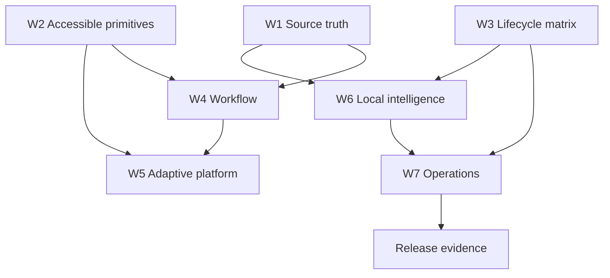

# Dependency Map

## Hard Gates

- Finance invariant fixtures precede `COR-001` through `COR-003` changes.
- Source semantics (`COR-001`, `COR-002`, `DOC-001`) precede `INNO-003`.
- `A11Y-001` shared primitive precedes page migration and `A11Y-003` controls.
- `BE-001` classification precedes `BE-002` or `CRUFT-001` movement.
- `BE-002` migration matrix precedes compatibility deletion or schema consolidation.
- `SEC-001` privacy tests precede `INNO-001` through `INNO-003`.
- Explicit observed snapshots (`DOC-001`, `INNO-002`) precede attribution.
- Production image and copied-DB preflight precede `OPS-001` rollback automation.

## Parallel Tracks

Correctness starts with W1. Accessibility starts with W2. Workflow and visual work starts after source vocabulary from W1. Platform work starts after W2 and W4 shared primitives. Compatibility architecture starts with W3. Test infrastructure starts with fixture definitions and joins every wave. Operations begins policy work in parallel but release automation waits for W3/W7. Local intelligence waits for W1 and privacy gate. Documentation and polish run after the owning surface is classified.

The graph is acyclic. W6 cannot bypass W1, W3, or privacy testing.
